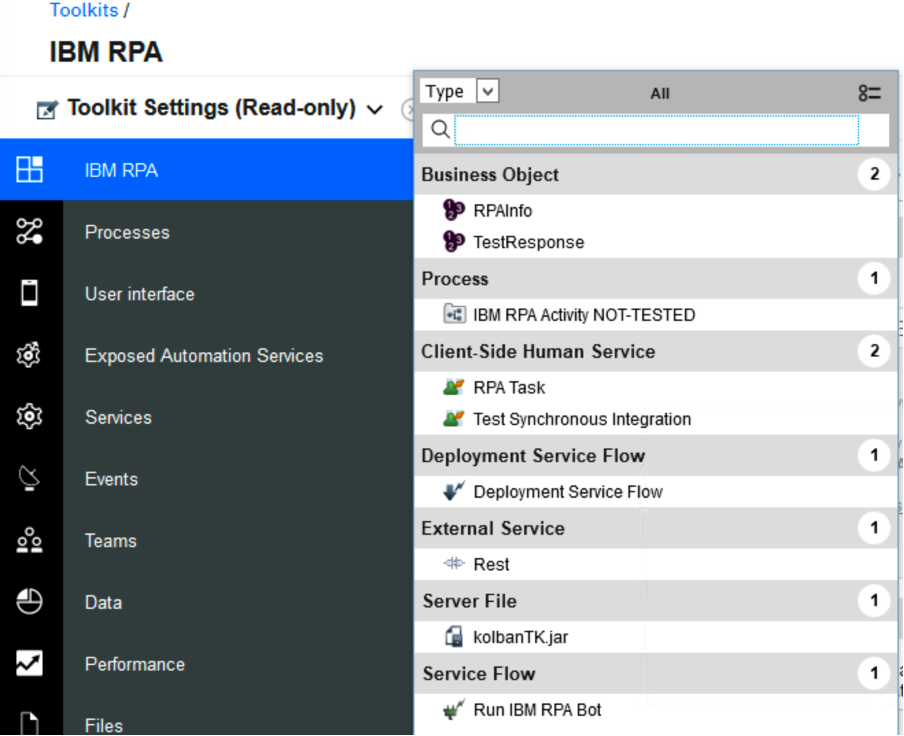
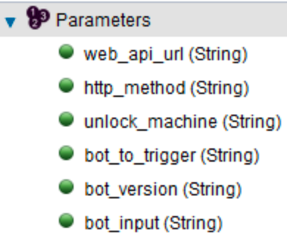
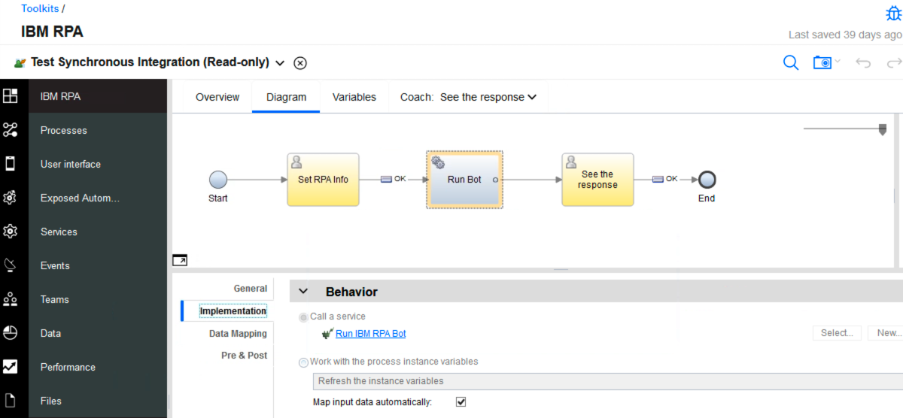
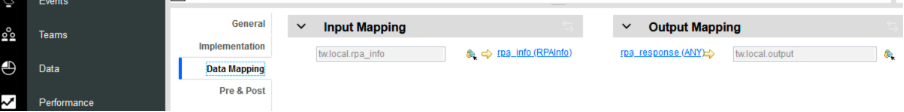
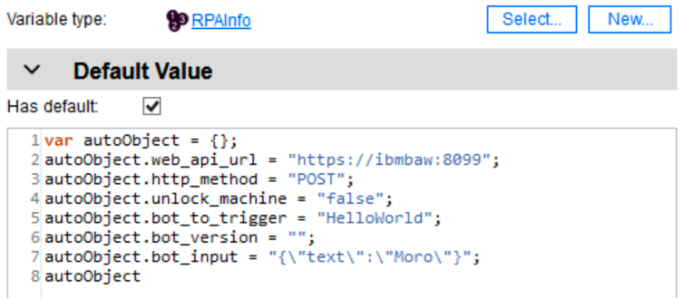
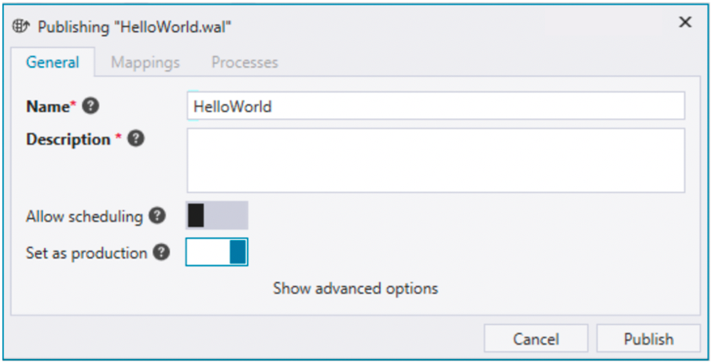

# IBM RPA Toolkit for BAW

## Introduction
As IBM offering management is working on enhancements in out-of-the-box integrations between BAW and IBM RPA, IBM technical sales organization provides this community asset to accelerate and enable usage of IBM RPA together with BAW.

To understand a bit better how the interaction between BAW and IBM RPA actually works, let’s first look at our current bot invocation mechanisms in IBM RPA.

There are several ways to start an IBM RPA bot. Using scheduling, orchestrations (and the underlying queuing infrastructure), Web API and exposing bots as chat bots.

The Web API is exposed by every IBM RPA agent service that you install and connect to your IBM RPA tenant. The operation of the API is described HERE. Currently the Web API has a fixed port and supports only synchronous (blocking) calls, but it is really easy to use and requires minimal information from your RPA environment:

- URL to your RPA Agent (https://<your_computer_address>:8099)
- Name of the bot you want to trigger
- Version number of the bot you want to trigger (optional)
- Input parameters for the bot (optional)
- Information if the RPA Agent computer needs to be unlocked to run the bot (true / false)

## The Toolkit
The first version of the Toolkit supports running IBM RPA bots synchronously using the Web API. We also plan to support asynchronous calls, but since that part needs some new readiness / custom components on the IBM RPA side, we have not yet implemented that.

When using synchronous calls, there are obviously some things to consider:

- If the bot runs for a long time, we might have a timeout for the call
- If there is no available RPA runtime for bot execution the call fails
- Best suited to run simple bots (queries / updates) with dedicated number of runtimes

Now, finally to the Toolkit itself 😄 Toolkit components are quite well documented already inside the Toolkit using the documentation fields, but let's walk through the components inside the toolkit.

### Toolkit components

>**Business Objects**

`RPAInfo` is the BO that you need to use when calling out for your bot. It has the following parameters:

- _web_api_url_ (String): the URL pointing to your RPA Agent’s Web API.
- _http_method_ (String): method you want to use, GET or POST are supported, but if you’re passing input parameters, you should always use POST.
- _unlock_machine_ (String): accepts true or false and determines if your agent environment (Windows) needs to be unlocked in order to run the bot.
- _bot_to_trigger_ (String): name of the bot – as it is in your RPA tenant repository – you want to run.
- _bot_version_ (String): version number of the bot you want to run.
- _bot_input_ (String): input parameters that you want to provide when calling the bot – needs to be in JSON String format (look Test Synchronous Integration CSHS for an example).

`TestResponse` is used for testing in the Test Synchronous Integration CSHS to handle the response back from the bot.

>**Processes**

`IBM RPA Activity NOT-TESTED` is the process to be used when calling out bots in asynchronous manner. As it was already discussed, the current Toolkit and the IBM RPA does not support this yet, but the Toolkit implementation is already in place.

>**Client-Side Human Services (CSHS)**

`RPA Task` is used by the IBM RPA Activity NOT-TESTED, so it is not in use in this version yet.

`Test Synchronous Integration` is a ready-made service for testing the synchronous call using the Run IBM RPA Bot service flow.

>**Deployment Service Flows**

Default implementation, not changed.

>**External Services**

`Rest` was automatically generated when defining to use _doRest_ method from the kolbanTK.jar.

>**Server Files**

`kolbanTK.jar` from the legendary BPM Toolkit by Mr. Neil Kolban. If it works, do not break it 😃 We use the REST call logic from the jar.

>**Service Flows**

`Run IBM RPA Bot` is the service flow that you need to use in order to run IBM RPA bot using the synchronous RPA Web API. Look _Test Synchronous Integration_ CSHS for an example.

## Testing the toolkit

Let’s a have a closer look of the Test Synchronous Integration CSHS to see an example how to use the toolkit.

The service has two simple coaches _Set RPA Info_ to set/edit the RPAInfo business object and _See the response_ to observe the result back from the RPA bot. The system service between the coaches calls the _Run IBM RPA Bot_ service flow and as you can see, takes RPAInfo as input and returns ANY type.

When you know, and you should, what your RPA bot will return (if anything), you can easily **cast** the ANY type response to your own business object using **JSON.parse()** that BAW nowadays supports by default. Obviously, the variable names and types in the business object you’re casting to need to match the ones that your RPA bot returns, but this is very easy way to make use of the data that your bot returns.

The picture below shows the default values for the RPAInfo business object in the test service. You can use that as an example when you’re testing your own bot integration. `Notice that the bot_input parameter needs to be in the JSON String format, and the attributes included – like “text” in the example – need to match the variable names of the bot you’re running.`

### One more thing

When testing the Toolkit, BAW is calling IBM RPA via `https`. This obviously means that you need to import the signer certificate from _**https:<your_rpa_agent_address>:8099**_ to your BAW keystore. If you do not know how to do that, these instructions might help: https://www.ibm.com/docs/en/was-nd/8.5.5?topic=communications-adding-signer-certificate-keystore

## Downloads

Finally, here the link to the toolkit, hope you find it useful!

[IBM RPA Toolkit for BAW](https://github.com/juseljuk/IBM-RPA-Toolkit-for-BAW/blob/master/downloads/IBM_RPA.twx)

Also, here's the link to the bot WAL scipt file, that works together with the `Test Synchronous Integration` CSHS testing service. Just make sure to publish the bot to your RPA tenant using the name _**HelloWorld**_ and `Set as production` flag enabled.

[Test Bot Script](https://github.com/juseljuk/IBM-RPA-Toolkit-for-BAW/blob/master/downloads/HelloWorld.wal)

##

All comments and improvement suggestions are most welcome 👍🏻

> Author Jukka Juselius, jukka.juselius@fi.ibm.com
