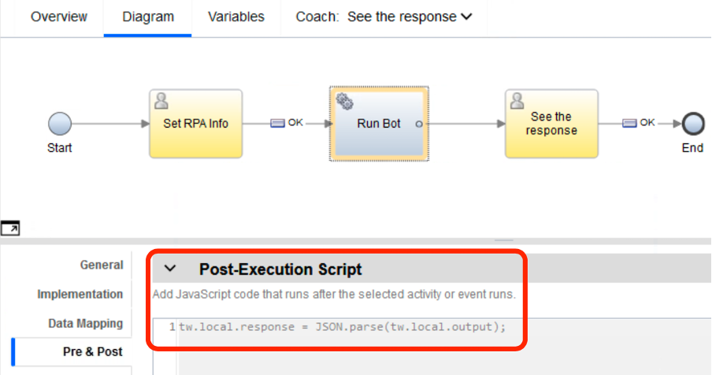

# IBM RPA Toolkit for BAW

## Introduction
As IBM offering management is working on enhancements in out-of-the-box integrations between BAW and IBM RPA, IBM technical sales organization provides this community asset to accelerate and enable usage of IBM RPA together with BAW.

To understand a bit better how the interaction between BAW and IBM RPA actually works, let’s first look at our current bot invocation mechanisms in IBM RPA.

There are several ways to start an IBM RPA bot. Using scheduling, orchestrations (and the underlying queuing infrastructure), Web API and exposing bots as chat bots.

The synchronous web API is exposed by every IBM RPA agent service that you install and connect to your IBM RPA tenant. The operation of the API is described [HERE](https://www.ibm.com/docs/en/rpa/21.0?topic=bot-starting-bots-by-api-call). Currently the API has a fixed port and supports only synchronous (blocking) calls, but it is really easy to use and requires minimal information from your RPA environment:

- URL to your RPA Agent (https://<your_computer_address>:8099)
- Name of the bot you want to trigger
- Version number of the bot you want to trigger (optional)
- Input parameters for the bot (optional)
- Information if the RPA Agent computer needs to be unlocked to run the bot (true / false)

**_NEW_** in IBM RPA version 21.0.2 is the IBM RPA Server API that we can use to trigger a IBM RPA Process **asynchronously** to run a bot assigned to it. _Using this API is now supported in toolkit version 2!_ The use of this Server API requires a bit more setting up:

- Need to define an RPA process (bot orchestration) using your RPA tenant's control center
- Input parameters for the bot to trigger via RPA Processes (optional)
- At least one queue created for the process
- Computers (bot runtimes) defined to run the process
- Computer credentials defined (needed to run the process)
- Computer definition changed to allow queue based processing
- Valid user credentials (RPA user) to access the Server API

## The Toolkit
The first version of the Toolkit supported only running IBM RPA bots synchronously using the web API exposed by any RPA runtime environment (agent service). The second version now supports running bots via the IBM RPA Server API that can be used to trigger orchestrations (IBM RPA Processes). The offcial documentation of the Server API can be found [HERE](https://www.ibm.com/docs/en/rpa/21.0?topic=api-starting-bot-in-orchestrator-process-via).

When using _synchronous_ calls, there are obviously some things to consider:

- If the bot runs for a long time, we might have a timeout for the call
- If there is no available RPA runtime for bot execution the call fails
- Best suited to run simple bots (queries / updates) with dedicated number of runtimes

When using _asynchronous_ calls, things to consider:

- This type of invocation is more natural for RPA, since bots can run for several minutes and based on availability of bot runtimes, they might be even delayed until a free runtime is available
- The mechanism is based on IBM RPA Process definition that allows you to define multiple bot runtimes for failover and load balancing
- Needs more settings and is harder to use than the synchronous API

Now, finally to the Toolkit itself 😄 Toolkit components are quite well documented already inside the Toolkit using the documentation fields, but let's walk through the components inside the toolkit.

### Toolkit components

>**Business Objects**

`InstanceIdObject` `InstanceStatusResponse` `LoginResponseObject` are all just helper BOs that are used to implement some of the TK logic. You do not need use them yourself when using the toolkit.

`RPAInfo` is the BO that you need to use when calling out your bot using the synchronous API. It has the following parameters:

- _web_api_url_ (String): the URL pointing to your RPA Agent’s Web API.
- _http_method_ (String): method you want to use, GET or POST are supported, but if you’re passing input parameters, you should always use POST.
- _unlock_machine_ (String): accepts true or false and determines if your agent environment (Windows) needs to be unlocked in order to run the bot.
- _bot_to_trigger_ (String): name of the bot – as it is in your RPA tenant repository – you want to run.
- _bot_version_ (String): version number of the bot you want to run.
- _bot_input_ (String): input parameters that you want to provide when calling the bot – needs to be in JSON String format (look Test Synchronous Integration CSHS for an example).

`RPAInfo_Srever_Async` is the BO that you need to use when calling out your bot using the new asynchronous RPA Server API. It has the following parameters:

- _server_api_url_ (String): the URL pointing to your RPA Server's API.
- _process_id_ (String): the ID of the RPA process you want to trigger.
- _tenant_id_ (String): the ID of the RPA tenant that has the process that you want to trigger.
- _bot_input_ (String): input parameter(s) that you want to provide when calling the RPA process – needs to be in JSON String format and wrapped to **payload** object. Look the documentation / example inside the toolkit.
- _username_ (String): name of the RPA user you want to use to trigger the process with.
- _password_ (String): password of the RPA user used to trigger the process.

`TestResponse` is used for testing in the Test Synchronous Integration CSHS to handle the response back from the bot.

>**Processes**

`IBM RPA Async Call` is the process to be used when calling out bots in asynchronous manner using the new RPA Server API. When it is invoked, you need to provide **RPAInfo_Server_Asynch** BO as input paramaters as well as _timeout_mins_ (Integer), _iterations_ (Integer) to determine how long (minutes) and how many times you want to wait for the RPA Process to complete the processing and _fire_and_forget_ (Boolean) to determine if you even want to wait for the RPA Process to finish.

The process first triggers the specified RPA process creating a new RPA process instance. If _fire_and_forget_ is **false** (the default), the process waits for a certain number of minutes (based on the _timeout_mins_ input variable) and then proceeds to check the status of the RPA process instance. If the process is finished, it sets the status code for OK (1), but if not, it goes back to wait and repeats the cycle as many times dictated by the input parameter _iterations_ if the RPA process has not finished. Returned status codes are:
- 1 = All Good
- 2 = Error Triggering the RPA Process
- 3 = Error Getting the RPA Process Status
- 4 = RPA Process did not finish during the defined wait cycle

Besides the status code, the process returns the RPA process (bot) output in form of JSON String. Since the format of the output depends on the signature of the RPA Process (bot) we're running, the user is responsible to handle the output. User can build a business object that has the same structure as the the returned JSON and map the returned JSON String to it using **JSON.parse()**.

>**Client-Side Human Services (CSHS)**

`Test Get Processes` is a helper service for getting the **process ID** for the process you want to trigger using the RPA Server API. Process IDs are immutable, so you only need to get the ID once and then you can use it in **RPAInfo_Server_Asynch** BO when triggering the bot.

`Test Get Tenants` is a helper service for getting the **tenant ID** that has the process you want to trigger using the RPA Server API. Tenant IDs are immutable, so you only need to get the ID once and then you can use it in **RPAInfo_Server_Asynch** BO when triggering the bot.

`Test Login to tenant` is a helper service for getting the **access token** for the tenant that has the process you want to trigger using the RPA Server API. You do not need to use this service since the code to get the access token is embedded to the toolkit functionality (**IBM RPA Async Call** process).

`Test Synchronous Integration` is a ready-made service for testing the synchronous call using the Run IBM RPA Bot service flow.

>**Deployment Service Flows**

Default implementation, not changed.

>**External Services**

`Rest` was automatically generated when defining to use _doRest_ method from the kolbanTK.jar.

>**Server Files**

`kolbanTK.jar` from the legendary BPM Toolkit by Mr. Neil Kolban. If it works, do not break it 😃 We use the REST call logic from the jar.

>**Service Flows**

`Get Instance Status` is a service flow used by the **IBM RPA Async Call** process that you should use for triggering an RPA Process via the Server API. You do not need to use it directly since it's integrated the process IBM RPA Async Call. It provides the functionality to call out your RPA Server and get the RPA process instance status that you have earlier created/started.

`Get Processes` is a helper service flow that is used by **Test Get Processes** CSHS. It retrieves all the one-step IBM RPA Processes - and their information - from your RPA Server tenant.

`Get Tenants` is a helper service flow that is used by **Test Get Tenants** CSHS. It retrieves all the tenants - and their information - the user has access to.

`Login to tenant` is a service flow used by the **IBM RPA Async Call** process that you should use for triggering an RPA Process via the Server API. You do not need to use it directly since it's integrated the process IBM RPA Async Call. It provides the functionality to login to your RPA Server tenant and get the access token for consecutive API calls. The service flow is also used by **Test Login to tenant** CSHS for testing the login procedure.

`Run IBM RPA Bot` is the service flow that you need to use in order to run IBM RPA bot using the synchronous RPA Web API. Look _Test Synchronous Integration_ CSHS for an example.

`Run IBM RPA Process via Server API` is the service flow used by the **IBM RPA Async Call** process that you should use for triggering an RPA Process via the Server API. You do not need to use it directly since it's integrated the process IBM RPA Async Call. It provides the functionality to trigger IBM RPA Process using the IBM RPA Server API.

## Testing the toolkit - synchronous API

Let’s a have a closer look of the Test Synchronous Integration CSHS to see an example how to use the toolkit.

The service has two simple coaches _Set RPA Info_ to set/edit the RPAInfo business object and _See the response_ to observe the result back from the RPA bot. The system service between the coaches calls the _Run IBM RPA Bot_ service flow and as you can see, takes RPAInfo as input and returns ANY type.

When you know, and you should, what your RPA bot will return (if anything), you can easily **cast** the ANY type response to your own business object using **JSON.parse()** that BAW nowadays supports by default. Obviously, the variable names and types in the business object you’re casting to need to match the ones that your RPA bot returns, but this is very easy way to make use of the data that your bot returns.

The picture below shows the default values for the RPAInfo business object in the test service. You can use that as an example when you’re testing your own bot integration. `Notice that the bot_input parameter needs to be in the JSON String format, and the attributes included – like “text” in the example – need to match the variable names of the bot you’re running.`

## Testing the toolkit - asynchronous RPA Server API

Testing the asynchronous invocation is a bit trickier than using the synchronous one. As mentiond, when we use the asynchronous IBM RPA Server API, we're not directly triggering a bot but an RPA process (aka orchestration) that needs to be first configured to your RPA server tenant you're using. For this you need to consult the official IBM RPA documentation: https://www.ibm.com/docs/en/rpa/21.0?topic=api-configuring-process

_**We're also planning to publish a lab exercise how to configure your IBM RPA environment and to test the toolkit.**_ Stay tuned! The lab will be published in [IBM RPA Community](https://ibm.biz/rpa-community).

## One more thing

When testing the Toolkit, BAW is calling IBM RPA via `https`. This obviously means that you need to import the signer certificate from _**https://<your_rpa_agent_address>:8099**_ (for synchronous invocation) and form _**https://<your_rpa_sever_api_address>**_ (for asynchronous invocation) to your BAW keystore. If you do not know how to do that, these instructions might help: https://www.ibm.com/docs/en/was-nd/8.5.5?topic=communications-adding-signer-certificate-keystore

## Downloads

Finally, here the link to the toolkit, hope you find it useful!

[IBM RPA Toolkit for BAW](https://github.com/juseljuk/IBM-RPA-Toolkit-for-BAW/blob/master/downloads/IBM_RPA.twx)

Also, here's the link to the bot WAL scipt file, that works together with the `Test Synchronous Integration` CSHS testing service. Just make sure to publish the bot to your RPA tenant using the name _**HelloWorld**_ and `Set as production` flag enabled.

[Test Bot Script](https://github.com/juseljuk/IBM-RPA-Toolkit-for-BAW/blob/master/downloads/HelloWorld.wal)

##

All comments and improvement suggestions are most welcome 👍🏻

> Author Jukka Juselius, jukka.juselius@fi.ibm.com
